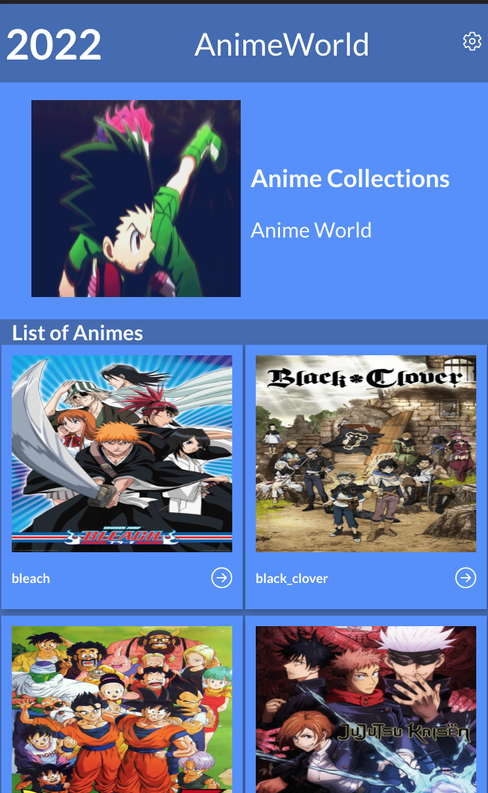

# Anime-World

> "Anime-World" is a website show list of animes and show different facts about them.

[Live Demo](scintillating-khapse-6ebe08.netlify.app)

Design From [Behance](https://www.behance.net/gallery/31579789/Ballhead-App-%28Free-PSDs%29)

## Built With

- HTML
- CSS
- JAVASCRIPT
- REACT
- REDUX

## Getting Started

Start by cloning the repository.

`git clone https://github.com/thermiee/React-Capstone.git`

Navigate to the created folder.

`cd React-Capstone`

Install all the dependencies.

`npm install`

Run the live server

`npm run start`

Go to [Localhost](http://localhost:3000)

Build the distribution folder before hosting the app

`npm run build`

After the build you can host the `build` folder.

## Authors

👤 **Emmanuel Jolugbo**

- GitHub: [Thermiee](https://github.com/thermiee)
- LinkedIn: [Emmanuel Jolugbo](https://www.linkedin.com/in/emmanuel-jolugbo/)
## 🤝 Contributing

Contributions, issues, and feature requests are welcome!

Feel free to check the [issues page](../../issues/).

## Acknowledgments

Thank you Microverse for the opportunity!

## Show your support

Give a ⭐️ if you like this project!

## 📝 License

This project is [GNU](./LICENSE) licensed.